---
output:
  html_document:
    toc: false
    css: apa_style.css
    theme: united
    highlight: pygments
    df_print: paged
    number_sections: false
  pdf_document:
    toc: false
---

::: {style="text-align: center; color: black; margin-top: 60px;"}
<h1>TRABAJO 3: SISTEMAS DE PREDICCIÓN, CLASIFICACIÓN Y RECOMENDACIÓN</h1>
<h2>REDES NEURONALES Y ALGORITMOS BIOINSPIRADOS</h2>
<br><br><br>
<p><strong>Presentado por:</strong></p>
<p>Marcos David Carrillo Builes<br> Tomás Escobar Rivera<br> Jose Fernando López Ramírez <br> Esteban Vásquez Pérez</p>
<br><br>
<p><strong>Profesor:</strong> Juan David Ospina Arango</p>
<p><strong>Monitor:</strong> Andrés Mauricio Zapata Rincón</p>
<br>  <br><br>
<p>Universidad Nacional de Colombia<br> Facultad de Minas<br> Ingeniería de Sistemas e Informática</p>
<p><strong>`r format(Sys.Date(), "%d de %B de %Y")`</strong></p>
:::

```{r setup, include=FALSE}
# ----------------------------------------
# Setup mínimo para tablas con kableExtra
# ----------------------------------------
if (!require("pacman")) install.packages("pacman")
pacman::p_load(
  knitr,       # Generación de tablas base
  kableExtra,  # Estilización de tablas
  magrittr     # Pipe %>%
)

# Configuración global de chunks
knitr::opts_chunk$set(
  echo = FALSE,
  warning = FALSE,
  message = FALSE
)
# ----------------------------------------
```

<div style="page-break-after: always;"></div>

## Tabla de Contenidos

- [Resumen Ejecutivo](#resumen-ejecutivo)
- [1. Introducción](#introduccion)
  - [1.1 Contexto y Motivación](#contexto)
  - [1.2 Planteamiento del Problema](#problema)
  - [1.3 Objetivos](#objetivos)
  - [1.4 Alcances y Limitaciones](#alcances)
- [2. Metodología](#metodologia)
  - [2.1 Enfoque General](#enfoque)
  - [2.2 Fases del Proyecto](#fases)
  - [2.3 Herramientas y Tecnologías](#herramientas)
- [3. Módulo 1 - Predicción de Demanda de Transporte](#modulo1)
  - [3.1 Descripción del Dataset](#31-descripción-del-dataset)
  - [3.2 EDA](#32-eda)
  - [3.3 Preprocesamiento y Preparación de Datos](#33-preprocesamiento-y-preparación-de-datos)
  - [3.4 Construcción y Entrenamiento del Modelo](#34-construcción-y-entrenamiento-del-modelo)
  - [3.5 Resultados del Modelo](#35-resultados-del-modelo)
  - [3.6 Análisis de las Métricas](#36-análisis-de-las-métricas)
  - [3.7 Gráficas de los resultados](#37-gráficas-de-los-resultados)
  - [3.8 Conclusiones](#38-conclusiones)
- [4. Módulo 2 - Clasificación de Conducción Distractiva](#modulo2)
  - [4.1 Descripción del Dataset](#41-descripción-del-dataset)
  - [4.2 Preprocesamiento de Imágenes](#42-preprocesamiento-de-imágenes)
  - [4.3 Arquitectura del Modelo](#43-arquitectura-del-modelo)
  - [4.4 Evaluación y Resultados](#44-evaluación-y-resultados)
  - [4.5 Análisis de Distracciones Comunes y Medidas Preventivas](#45-análisis-de-distracciones-comunes)
  - [4.6 Proceso Iterativo de Optimización del Modelo](#46-proceso-optimizacion)
- [5. Módulo 3 - Recomendación de Destinos de Viaje](#modulo3)
  - [5.1 Introducción](#51-introducción)
  - [5.2 Análisis Exploratorio de Datos](#52-análisis-exploratorio-de-datos)
  - [5.3 Arquitectura del Modelo](#53-arquitectura-del-modelo)
  - [5.4 Evaluación y Resultados](#54-evaluación-y-resultados)
  - [5.5 Conclusiones](#55-conclusiones)
- [6. Herramienta Web Integrada](#herramienta-web)
- [7. Resultados Generales y Discusión](#resultados)
- [8. Conclusiones y Recomendaciones](#conclusiones)
- [9. Aspectos Éticos y Creatividad](#etica)
- [10. Bibliografía](#bibliografia)
- [11. Anexos](#anexos)

---

## Resumen Ejecutivo {#resumen-ejecutivo}

El sector del transporte turístico enfrenta desafíos complejos que requieren soluciones tecnológicas avanzadas para optimizar operaciones, garantizar seguridad y personalizar experiencias. Este proyecto desarrolló un **sistema integrado de inteligencia artificial** que aborda tres problemas críticos: la predicción de demanda de transporte, la detección de conducción distractiva y la recomendación personalizada de destinos turísticos.

**Problema y Objetivos:** Se identificaron tres necesidades fundamentales en empresas de transporte turístico: (1) anticipar la demanda de pasajeros para optimizar recursos y planificación operativa, (2) detectar comportamientos distractivos en conductores para mejorar la seguridad vial, y (3) ofrecer recomendaciones personalizadas de destinos para mejorar la experiencia del usuario. El objetivo principal fue desarrollar modelos de aprendizaje profundo funcionales e integrarlos en una herramienta web unificada.

**Solución y Tecnologías:** Se implementaron tres módulos independientes utilizando diferentes arquitecturas de redes neuronales: (1) un modelo **LSTM con mecanismo de atención** para predicción de series temporales de demanda, (2) una **red neuronal convolucional (CNN)** diseñada desde cero para clasificación de imágenes de conductores, y (3) un sistema de **filtrado colaborativo con embeddings** para recomendación de destinos. Las tecnologías empleadas incluyeron Python, TensorFlow/Keras, Gradio para la interfaz web, y recursos de GPU gratuitos de Kaggle para entrenamiento.

**Resultados Principales:** El modelo de predicción de demanda alcanzó un error absoluto medio de aproximadamente **113 pasajeros (1% del valor medio)**, demostrando excelente capacidad predictiva. El clasificador de conducción obtuvo un **accuracy de 64.7%** con F1-scores superiores a 0.77 en las clases críticas como `texting_phone` y `talking_phone`. El sistema de recomendación logró un **MAE de 1.226 estrellas** en la predicción de calificaciones, siendo efectivo para personalización básica. Los tres módulos fueron exitosamente integrados en una aplicación web funcional desplegada en Hugging Face Spaces.

**Conclusión:** Este trabajo demuestra la viabilidad y efectividad de aplicar técnicas de aprendizaje profundo en el sector del transporte turístico. Los modelos desarrollados ofrecen un punto de partida robusto para sistemas de transporte inteligente, con potencial de implementación real tras ajustes con datos operativos específicos. La integración exitosa de múltiples modelos en una herramienta web accesible evidencia el valor práctico de soluciones de IA aplicadas a problemas empresariales reales.

# 1 Introducción {#introduccion}

## 1.1 Contexto y Motivación {#contexto}

El sector del transporte y el turismo enfrenta retos complejos que requieren soluciones avanzadas. Por un lado, las empresas de transporte deben anticipar la **demanda** de viajes y garantizar la **seguridad vial**, mientras que, por otro, en la industria turística es crucial ofrecer experiencias personalizadas a los usuarios mediante **sistemas de recomendación** inteligentes. En ambos ámbitos, las *redes neuronales profundas* se han posicionado como herramientas poderosas para abordar estos problemas complejos, gracias a su capacidad de aprender patrones intrincados a partir de grandes volúmenes de datos heterogéneos (por ejemplo, imágenes, series de tiempo y preferencias de usuarios) [Xiao et al., 2025].

Un problema crítico en transporte es la **conducción distraída**, la cual se reconoce como una de las principales causas de accidentes de tráfico a nivel mundial [Sorum & Sorum, 2025]. Solo en 2022, se reportaron más de 3.300 muertes en Estados Unidos asociadas a choques con conductores distraídos [National Conference of State Legislatures, 2025], evidenciando la urgencia de mejorar la seguridad vial. Tecnologías de visión por computador basadas en *deep learning* pueden ayudar a monitorear en tiempo real el comportamiento del conductor para detectar distracciones y prevenir accidentes. Simultáneamente, en el ámbito del turismo, los viajeros se enfrentan a una sobreabundancia de opciones. Un **sistema de recomendación de destinos turísticos** personalizado puede mejorar enormemente la experiencia al sugerir destinos acordes a las preferencias individuales de cada usuario. Las técnicas de *deep learning* han demostrado mejorar la precisión de estas recomendaciones al procesar información compleja de usuarios y destinos, superando las limitaciones de métodos tradicionales [Xiao et al., 2025].

Además, la planificación operativa del transporte (por ejemplo, predecir cuántos pasajeros usarán cierta ruta en el futuro cercano) es otro desafío que puede abordarse con modelos de aprendizaje profundo. Prever la demanda de transporte con antelación permite optimizar recursos y rutas, contribuyendo a un servicio más eficiente.

La motivación central de nuestro trabajo es integrar soluciones basadas en redes neuronales profundas para mejorar **tres aspectos clave** en una empresa de transporte turístico: la **predicción de demanda**, la **detección de conducción distraída** y la **personalización de recomendaciones de viaje**. La disponibilidad de potentes recursos de cómputo en la nube –como las GPU ofrecidas en entornos Kaggle– ha democratizado el desarrollo de estos modelos, permitiéndonos entrenar redes profundas desde cero sin necesidad de infraestructura local costosa.

## 1.2 Planteamiento del Problema {#problema}

El presente proyecto se enfoca en resolver los siguientes problemas interrelacionados mediante el uso de técnicas de *deep learning*:

- ¿Cómo predecir la demanda de transporte en rutas específicas en los próximos 30 días para garantizar una planificación óptima de vehículos y personal?
- ¿Cómo clasificar imágenes de conductores para identificar comportamientos distractores que pongan en riesgo la seguridad de los pasajeros?
- ¿Cómo sugerir destinos turísticos personalizados a los clientes, basándose en su historial de viajes y preferencias?

Estos desafíos, de naturaleza compleja y multidimensional, requieren modelos de aprendizaje capaces de capturar relaciones no lineales en datos temporales, visuales y contextuales, tarea en la que las redes neuronales profundas han demostrado un desempeño sobresaliente.

## 1.3 Objetivos {#objetivos}

A partir del diagnóstico anterior, se definen los siguientes objetivos específicos:

- **Predicción de Demanda:** Construir un modelo predictivo para anticipar la cantidad de pasajeros por ruta, empleando datos históricos y técnicas de modelado de series temporales.
- **Clasificación de Conductores:** Implementar una red neuronal convolucional (CNN) diseñada manualmente para detectar automáticamente conductas distractoras en imágenes de conductores.
- **Recomendación de Destinos:** Desarrollar un sistema de recomendación personalizado que sugiere destinos de viaje usando el historial de viajes y preferencias de cada usuario.

Adicionalmente, se propone integrar los tres módulos anteriores en una herramienta web funcional y amigable, que permita visualizar predicciones, cargar imágenes y recibir recomendaciones en tiempo real.

## 1.4 Alcances y Limitaciones {#alcances}

Este proyecto contempla la implementación de modelos funcionales para cada uno de los tres módulos mencionados, entrenados con datos públicos recopilados en contextos reales de India (turismo) y Bangladesh (conducción). Sin embargo, existen las siguientes limitaciones:

- **Generalización limitada:** Los modelos fueron entrenados con datasets específicos (por ejemplo, imágenes capturadas en Dhaka), lo cual restringe su capacidad de generalizar a otras regiones o condiciones.
- **Recursos computacionales:** Si bien se usaron GPUs gratuitas de Kaggle, la exploración completa del espacio de hiperparámetros fue acotada por tiempo y capacidad.
- **Interpretabilidad:** Aunque se optó por diseñar una CNN desde cero para mayor comprensión, las decisiones del modelo no siempre son fácilmente explicables a usuarios finales.
- **Cobertura geográfica y de usuarios:** El sistema de recomendación está limitado a los destinos del dataset de India, y la predicción de demanda se basa en datos históricos simulados o restringidos.

A pesar de lo anterior, los modelos desarrollados representan un punto de partida robusto y funcional para construir sistemas de transporte inteligente aplicables en la práctica.


# 2 Metodología {#metodologia}

## 2.1 Enfoque General {#enfoque}

Para abordar los retos definidos, adoptamos un enfoque estructurado basado en los principios del **Design Thinking**, una metodología centrada en comprender profundamente el problema, idear soluciones efectivas y evaluar su impacto desde la perspectiva de los usuarios. Aunque originalmente se asocia al diseño de productos, su estructura nos permitió organizar de forma eficiente el trabajo colaborativo en este proyecto:

- **Empatizar:** Analizamos los desafíos de la empresa de transporte, reconociendo la importancia de anticipar la demanda, detectar comportamientos riesgosos al volante y personalizar la experiencia turística.
- **Definir:** Delimitamos tres problemas clave: predicción de demanda, clasificación de conducción distractiva y recomendación de destinos.
- **Idear:** Diseñamos una solución compuesta por tres modelos independientes que se integrarían en una sola herramienta web.
- **Prototipar:** Implementamos y entrenamos modelos funcionales con datos reales, aprovechando recursos computacionales gratuitos como las GPUs de Kaggle.
- **Evaluar:** Analizamos métricas de desempeño para cada módulo y reflexionamos sobre su aplicabilidad práctica en entornos reales.

Este enfoque nos permitió mantener una visión clara del proyecto, fomentar la colaboración continua entre integrantes y construir soluciones con impacto potencial para la industria del transporte y el turismo.

## 2.2 Fases del Proyecto {#fases}

El desarrollo del sistema inteligente se estructuró en varias fases iterativas, que nos permitieron avanzar progresivamente desde la planificación hasta la implementación técnica:

1. **Inicialización del entorno y recursos:**
   - Creamos dos repositorios en GitHub: uno para el desarrollo de la app web y otro para los notebooks en Kaggle.
   - Configuramos el pipeline de despliegue continuo para la app en **Hugging Face Spaces** con `Gradio`.
   - Establecimos una plantilla base en **RPubs** para redactar el informe técnico de manera colaborativa.
   - Definimos el stack de herramientas: Python, Gradio, TensorFlow/Keras, Kaggle Notebooks y almacenamiento externo en Google Drive para modelos de gran tamaño.

2. **Construcción del modelo de clasificación de imágenes:**
   - Iniciamos el desarrollo del módulo de visión artificial por ser el más factible en términos de datos disponibles y claridad del objetivo.
   - En lugar de emplear arquitecturas preexistentes como AlexNet, optamos por construir manualmente una **CNN bottom-up**, lo cual nos permitió comprender mejor el impacto de cada capa y adaptar el modelo a nuestros recursos computacionales.

3. **Paralelización de módulos restantes:**
   - Una vez consolidado el modelo de clasificación, distribuimos el trabajo para abordar los otros módulos:
     - **José** y **Marcos** comenzaron a explorar el dataset de turismo para construir un sistema de recomendación basado en filtrado colaborativo con embeddings.
     - **Tomás** se encargó de explorar los datos para modelar la demanda de transporte mediante series temporales.
     - **Esteban** lideró la organización de los repositorios, el despliegue técnico y la redacción del informe, garantizando una documentación clara y continua.

4. **Colaboración y revisión continua:**
   - Establecimos **reuniones semanales cada domingo**, en las que discutíamos avances, compartíamos aprendizajes y coordinábamos las siguientes tareas.
   - Utilizamos funciones colaborativas de GitHub como issues, branches y pull requests para mantener un control claro del desarrollo.

## 2.3 Herramientas y Tecnologías {#herramientas}

Durante el proyecto, empleamos un conjunto variado de herramientas que nos permitió construir, probar y desplegar nuestras soluciones de manera eficiente:

Las herramientas utilizadas en el proyecto fueron:

- **Kaggle**: Entrenamiento de modelos en notebooks con GPU gratuita.
- **RPubs**: Redacción y publicación del informe técnico.
- **Hugging Face Spaces**: Hosting de la app web con despliegue automatizado.
- **Gradio**: Creación de la interfaz gráfica para uso de modelos desde el navegador.
- **GitHub**: Control de versiones, desarrollo colaborativo y documentación.
- **Google Drive**: Almacenamiento de modelos pesados de forma externa.

El uso articulado de estas tecnologías nos permitió mantener un flujo de trabajo ordenado, reproducible y alineado con las necesidades técnicas y comunicativas del proyecto.

# 3. Módulo 1 - Predicción de Demanda de Transporte {#modulo1}

## 3.1 Descripción del Dataset {#31-descripción-del-dataset}

En este proyecto generamos un dataset sintético que simula la demanda de transporte turístico en India, específicamente en rutas que parten desde **Delhi Hub** hacia cinco destinos turísticos populares: **Taj Mahal, Goa Beaches, Jaipur City, Kerala Backwaters y Leh Ladakh**.

El objetivo principal de este dataset es modelar y predecir la demanda diaria de pasajeros en función de múltiples factores temporales, operativos y externos.

### Variables Incluidas

```{r tabla-variablesn}
tabla_variables <- data.frame(
  Variable = c(
    "ride_id", "travel_date", "travel_time", "departure_city", "destination",
    "vehicle_type", "max_capacity", "actual_passengers", "load_factor",
    "payment_method", "weather_condition", "ticket_price", "duration_hours",
    "special_event", "month", "day_of_week", "is_weekend", "canceled"
  ),
  
  Descripcion = c(
    "Identificador único del viaje",
    "Fecha del viaje",
    "Hora de salida del viaje",
    "Ciudad de origen (siempre 'Delhi Hub')",
    "Ciudad de destino (5 opciones)",
    "Tipo de vehículo (luxury_bus, standard_bus, minibus, van)",
    "Capacidad máxima del vehículo",
    "Número real de pasajeros en ese viaje",
    "Factor de ocupación (pasajeros / capacidad)",
    "Método de pago (cash, mobile_payment, credit_card, travel_card)",
    "Condiciones meteorológicas (sunny, rainy, cloudy, foggy, stormy)",
    "Precio del boleto según el destino",
    "Duración estimada del viaje en horas",
    "Indicador de evento especial (1 si hay evento, 0 si no)",
    "Mes del año (1 a 12)",
    "Día de la semana (0 = lunes, ..., 6 = domingo)",
    "Indicador de fin de semana (TRUE/FALSE)",
    "Indicador de cancelación del viaje (1 si fue cancelado, 0 si no)"
  ),
  
  Tipo = c(
    "Numérica", "Fecha", "Hora", "Categórica", "Categórica",
    "Categórica", "Numérica", "Numérica", "Numérica",
    "Categórica", "Categórica", "Numérica", "Numérica",
    "Binaria", "Numérica", "Numérica", "Binaria", "Binaria"
  )
)

knitr::kable(tabla_variables,
  caption = "Tabla 1: Descripción de las variables del dataset de demanda de transporte",
  format = "html"
) %>%
  kableExtra::kable_styling(
    bootstrap_options = c("striped", "hover"),
    full_width = FALSE
  ) %>%
  kableExtra::column_spec(1:3, width = "6cm") %>%
  kableExtra::row_spec(0, bold = TRUE, color = "black", background = "lightgray")
```


### Patrones Realistas Incluidos en el Dataset

- **Estacionalidad:** Cada destino presenta temporadas altas y bajas que afectan significativamente la demanda. Por ejemplo, Goa Beaches tiene alta demanda en invierno (noviembre a marzo) y muy baja en temporada de lluvias (junio a septiembre).

- **Efecto de fin de semana:** Hay un incremento de la demanda los sábados y domingos.

- **Efecto horario:** Se observa mayor ocupación en las salidas de la mañana (7-10 am) y en la tarde (4-7 pm).

- **Condiciones climáticas:** El mal clima (lluvia, tormentas o niebla) reduce la demanda debido a las condiciones desfavorables para el turismo.

- **Eventos especiales:** En días con eventos turísticos o culturales, la demanda se incrementa aproximadamente un 50%.

- **Cancelaciones:** Un 5% de los viajes son cancelados, lo cual impacta directamente en el número de pasajeros de esos viajes (se fijan en 0).

### Objetivo del Dataset

Este dataset fue diseñado para resolver un problema de predicción de demanda futura. El modelo puede aprender a anticipar cuántos pasajeros habrá en un viaje futuro, teniendo en cuenta factores temporales (mes, día, hora), condiciones meteorológicas, eventos especiales, tipo de vehículo, capacidad y patrones de comportamiento de los usuarios.

Esta predicción es útil para:

- **Optimización de operaciones:** Seleccionar el tamaño adecuado de los vehículos.
- **Gestión de recursos:** Planificar mejor conductores, horarios y frecuencia.
- **Mejora en la rentabilidad:** Ajustar precios o promociones según la demanda esperada.


## 3.2 EDA {#32-eda}

### 1. **Demanda Diaria Total de Transporte (Gráfico 1)**

```{r fig1-eda-demanda, out.width="60%", fig.align='center', fig.cap='Figura 1.'}
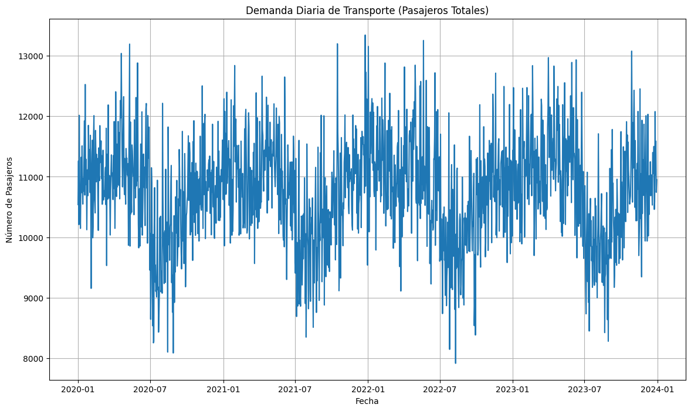
```

* Hay **variabilidad diaria considerable**, pero la serie parece mantener un comportamiento relativamente estable en el largo plazo.
* Hay picos y valles notables, lo que sugiere que podría haber **patrones estacionales** o eventos puntuales que afectan la demanda (feriados, clima, etc.).
* Esto sugiere que se requiere un modelo que pueda manejar fluctuaciones a corto plazo (como una LSTM con input diario o semanal).

### 2. **Descomposición Estacional de la Demanda Mensual (Gráfico 2)**

```{r fig2-eda-demanda, out.width="60%", fig.align='center', fig.cap='Figura 2. '}
knitr::include_graphics("imgs/demanda/eda_demanda_2.png")
```

* **Tendencia:** Aumenta hasta 2022 y luego se estabiliza o decrece ligeramente.
* **Estacionalidad:** Se observa un patrón repetitivo claro (picos anuales), indicando que hay **efectos mensuales estacionales** importantes.
* **Residuos:** Parecen ser ruido blanco o variaciones aleatorias no explicadas por el modelo.

La estacionalidad mensual sugiere que se debe incorporar **componentes estacionales (ej. SARIMA, LSTM con embeddings de mes)**.

### 3. **Función de Autocorrelación (ACF) y Autocorrelación Parcial (PACF) (Gráfico 3)**

```{r fig3-eda-demanda, out.width="60%", fig.align='center', fig.cap='Figura 3. '}
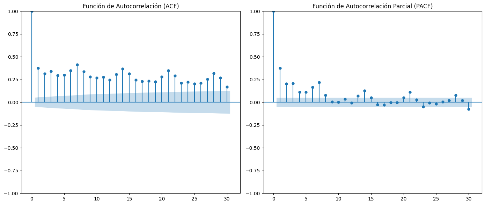
```

* La ACF tiene un primer valor muy alto (esperado) y luego valores bajos pero positivos durante varios lags → indica que hay **alguna autocorrelación**, pero no muy fuerte.
* La PACF decae rápido → sugiere que la serie podría ser **ARIMA de bajo orden** o que **no tiene una fuerte dependencia temporal inmediata** (lo que puede favorecer enfoques tipo LSTM con ventanas más amplias).

### 4. **Comparación con Diferenciación (Gráfico 4)**

```{r fig4-eda-demanda, out.width="60%", fig.align='center', fig.cap='Figura 4. '}
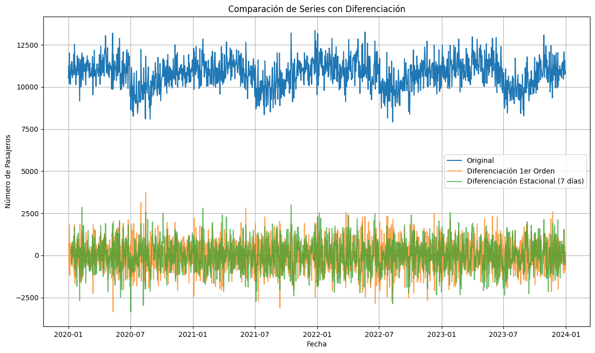
```

* Al aplicar **diferenciación de primer orden** y **estacional (lag=7 días)**, la serie parece estabilizarse alrededor de 0.
* Esto sugiere que la serie **no es estacionaria originalmente**, pero puede transformarse en estacionaria mediante diferenciación.

Esto es importante si se van a usar modelos tradicionales como SARIMA o ARIMA: necesitan estacionarizar la serie antes.

### 5. **Demanda Mensual por Destino (Gráfico 5)**

```{r fig5-eda-demanda, out.width="60%", fig.align='center', fig.cap='Figura 5. '}
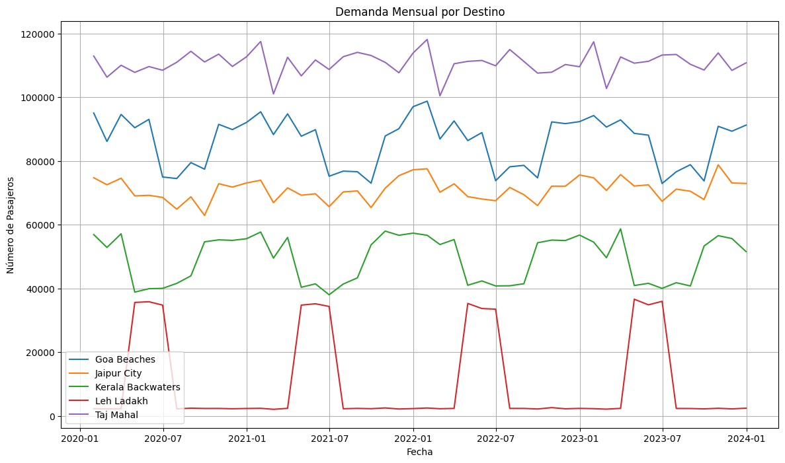
```

* Las rutas tienen **comportamientos distintos**, por ejemplo:

  * **Leh Ladakh** muestra una estacionalidad **muy marcada** (actividad sólo en meses específicos).
  * **Taj Mahal** y **Goa Beaches** muestran una demanda más constante.

* Esto refuerza la necesidad de **modelos por ruta específica**, posiblemente entrenando un modelo individual por ruta o incluyendo la variable "ruta" como input categórico en un modelo multivariado (ej. LSTM multirruta).

### 6. **Demanda Promedio por Día de la Semana (Gráfico 6)**

```{r fig6-eda-demanda, out.width="60%", fig.align='center', fig.cap='Figura 6. '}
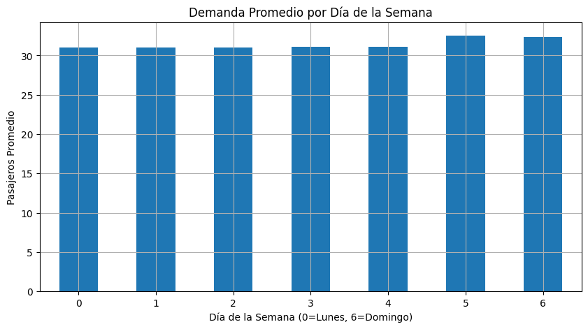
```

* Sábados y domingos tienen mayor demanda → **hay un patrón semanal claro**.
* Esto debe incluirse como una variable categórica en el modelo (día de la semana como input).

### 7. **Distribución de Pasajeros por Mes (Gráfico 7)**

```{r fig7-eda-demanda, out.width="60%", fig.align='center', fig.cap='Figura 7. '}
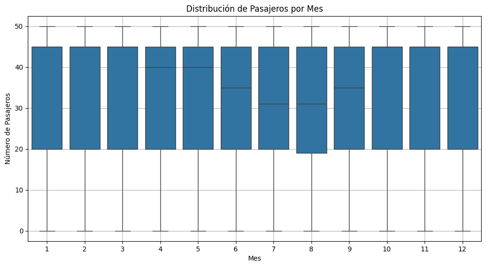
```

* Aunque los promedios parecen similares, los rangos (mínimo y máximo) varían, especialmente entre junio y septiembre.
* Puede haber más **variabilidad en meses de vacaciones o eventos especiales**, lo cual justifica agregar "mes" como variable en el modelo o aplicar normalización por mes.

---

Basado en el análisis exploratorio y en los requerimientos específicos del problema, la arquitectura seleccionada fue un modelo híbrido basado en LSTM con un mecanismo de atención. Esta elección se justifica porque las redes LSTM son especialmente adecuadas para trabajar con datos secuenciales como las series temporales, permitiendo capturar dependencias de largo plazo dentro de la demanda histórica. Además, la incorporación de una capa de atención permite al modelo enfocar su capacidad predictiva en los patrones más relevantes dentro de la secuencia, como las variaciones estacionales, los cambios por horarios o las fluctuaciones debidas a eventos especiales. Por otra parte, esta arquitectura es capaz de integrar tanto información temporal como variables categóricas o contextuales, lo que la hace especialmente robusta para abordar la complejidad del problema planteado.


## 3.3 Preprocesamiento y Preparación de Datos {#33-preprocesamiento-y-preparación-de-datos}

El preprocesamiento del dataset incluyó un proceso de ingeniería de características donde, a partir de la fecha del viaje (`travel_date`), se extrajeron el año, el mes y el día de la semana. De manera similar, de la hora de salida (`travel_time`) se derivó la variable `hour`. También se generó la variable `high_season`, que indica si un viaje ocurre durante la temporada alta, definida según cada destino. Por ejemplo, para Taj Mahal corresponde de noviembre a febrero, para Goa Beaches de noviembre a marzo y para Leh Ladakh de abril a junio, entre otros.

Se eliminaron variables que no aportaban información relevante o que podían generar fuga de datos, como `ride_id`, `travel_date`, `travel_time`, `load_factor`, `canceled` e `is_weekend`. Las variables finales se dividieron en categóricas (como destino, tipo de vehículo, método de pago o clima) y numéricas (como capacidad, precio, duración, variables temporales y `special_event`).

El pipeline de preprocesamiento incluyó imputación de datos faltantes (mediana para variables numéricas y moda para categóricas), junto con escalado de las numéricas mediante `StandardScaler` y codificación one-hot para las categóricas.

La división de datos se realizó respetando la secuencia temporal, utilizando el 80% de las fechas más antiguas para entrenamiento y el 20% más recientes para prueba. Posteriormente, se estructuró la serie temporal de demanda (`actual_passengers`) en secuencias, donde cada muestra utiliza los 90 días anteriores como entrada para predecir la demanda de los 30 días siguientes. Este esquema permite capturar la dependencia temporal de la serie y es adecuado para modelos LSTM.


## 3.4 Construcción y Entrenamiento del Modelo {#34-construcción-y-entrenamiento-del-modelo}

### Arquitectura del Modelo

El modelo desarrollado es una red neuronal secuencial con memoria a largo plazo (LSTM) complementada con un mecanismo de atención, diseñada para predecir la demanda de transporte durante los próximos 30 días, utilizando como entrada un historial de 90 días.

La arquitectura se compone de los siguientes elementos:

1. **Entrada**
   Una secuencia temporal con la forma `(90 días, 1 feature)`, que corresponde a la demanda histórica de pasajeros previamente escalada.

2. **Capa LSTM**

   * Una capa LSTM con 128 unidades y `return_sequences=True`, lo que permite devolver una salida por cada paso temporal de la secuencia.
   * Posteriormente se aplica una capa de regularización `Dropout` con una tasa de 0.2 para evitar sobreajuste.

3. **Mecanismo de Atención**
   Este componente permite que el modelo aprenda a asignar diferentes pesos a cada paso temporal de la secuencia, enfocándose más en aquellos días del pasado que son más relevantes para la predicción futura.
   El mecanismo funciona de la siguiente manera:

   * Se calcula un vector de atención mediante una capa densa con activación `tanh`.
   * Este vector se normaliza mediante `softmax` para convertirlo en pesos.
   * Los pesos se aplican sobre la salida de la LSTM mediante una operación de multiplicación ponderada.
   * Finalmente, se genera una representación agregada de la secuencia como suma ponderada de los estados ocultos.

4. **Capas Densas**

   * Una capa `Dense` con 64 neuronas y activación `relu` para capturar relaciones no lineales.
   * Se agrega una segunda capa `Dropout` con tasa de 0.1 como medida de regularización.

5. **Capa de Salida**

   * Una capa `Dense` con 30 neuronas, que corresponde a la predicción de la demanda para los 30 días siguientes.

6. **Compilación**

   * Función de pérdida: `mean_squared_error (mse)`.
   * Métrica de evaluación: `mean_absolute_error (mae)`.
   * Optimizador: `Adam` con tasa de aprendizaje de 0.001.

### Callbacks Utilizados

Se incorporan dos mecanismos para mejorar el entrenamiento y evitar el sobreajuste:

* **EarlyStopping**
  Detiene el entrenamiento si la métrica de validación no mejora durante 15 épocas consecutivas y restaura los mejores pesos obtenidos hasta ese momento.

* **ModelCheckpoint**
  Guarda automáticamente el mejor modelo basado en la pérdida de validación, en un archivo llamado `best_model.h5`.

### Entrenamiento del Modelo

El modelo se entrena con los siguientes parámetros:

* Número máximo de épocas: 100.
* Tamaño del batch: 32.
* Datos de validación: Se utiliza el 20% más reciente de la serie temporal.
* Verbose: Nivel 1 (muestra el progreso del entrenamiento en consola).

El entrenamiento finaliza de forma anticipada si la métrica de validación deja de mejorar, gracias al uso de EarlyStopping.


## 3.5 Resultados del Modelo {#35-resultados-del-modelo}

### Desempeño del Modelo

Después del proceso de entrenamiento utilizando la arquitectura híbrida LSTM con atención, se obtuvieron los siguientes resultados:

* **Pérdida (loss) en entrenamiento:** 0.0211
* **Error Absoluto Medio (MAE) en entrenamiento:** 0.1167
* **MAE en datos de prueba:** 0.1132 (escala normalizada)

Métricas calculadas sobre los datos reales (desescalados):

* **MAE en test:** aproximadamente **113 pasajeros**
* **RMSE en test:** aproximadamente **771.79 pasajeros**

Estadísticas de la demanda real en el conjunto de prueba:

* **Media de la demanda real:** 10,724.46 pasajeros
* **Desviación estándar:** 925.96 pasajeros


## 3.6 Análisis de las Métricas {#36-análisis-de-las-métricas}

* El **MAE (Error Absoluto Medio)** de aproximadamente **113 pasajeros** indica que, en promedio, el modelo se equivoca por esa cantidad al predecir la demanda diaria. Comparado con una media de más de 10,000 pasajeros diarios, este error representa un porcentaje muy bajo (aproximadamente **1% del valor medio**), lo cual es excelente para este tipo de predicciones.

* El **RMSE (Raíz del Error Cuadrático Medio)** es más alto, **771.79 pasajeros**, lo que indica que aunque la mayoría de las predicciones son precisas, existen algunos días con errores significativamente mayores (los cuales afectan más al RMSE que al MAE, por ser sensible a valores extremos).

* La baja pérdida (`loss = 0.0211`) y el bajo MAE en entrenamiento y validación sugieren que el modelo ha logrado un buen ajuste, sin sobreajuste evidente.

* Comparado con la desviación estándar de la demanda real (**925.96**), el RMSE es algo menor pero está en la misma magnitud, lo cual es esperable. Esto implica que el error típico es menor que la variación natural de la demanda.


## 3.7 Gráficas de los resultados {#37-gráficas-de-los-resultados}

```{r fig8-per-route-goa, out.width="70%", fig.align='center', fig.cap='Figura 8. Comparación entre la demanda real y la demanda predicha para la ruta Goa Beaches.'}
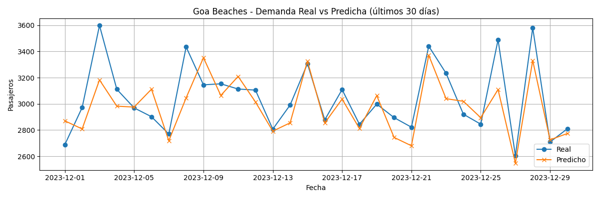
```

**Descripción:**
En la **Figura 8** se observa la comparación entre la demanda real y la demanda predicha específicamente para la ruta hacia **Goa Beaches**. El modelo logra capturar correctamente los picos de alta demanda y las caídas, manteniéndose generalmente cerca de los valores reales. Sin embargo, pueden observarse pequeñas desviaciones en algunos períodos, lo cual es esperable debido a factores impredecibles o ruido en los datos.En todas las otras imágenes podemos obtener la misma conclusión. 


```{r fig9-per-route-jaipur, out.width="70%", fig.align='center', fig.cap='Figura 9. Comparación entre la demanda real y la demanda predicha para la ruta Jaipur City.'}
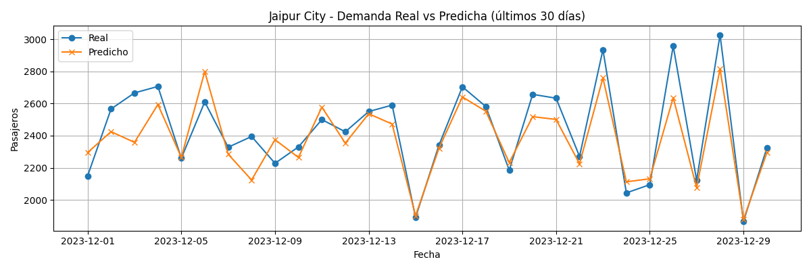
```

**Descripción:**
La **Figura 9** muestra la comparación para la ruta **Jaipur City**, donde el modelo refleja adecuadamente los patrones estacionales y los picos en la demanda. Las diferencias tienden a ser pequeñas y es capaz de seguir las tendencias generales.


```{r fig10-per-route-kerala, out.width="70%", fig.align='center', fig.cap='Figura 10. Comparación entre la demanda real y la demanda predicha para la ruta Kerala Backwaters.'}
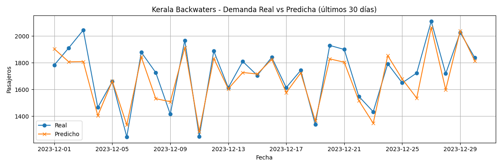
```

**Descripción:**
En la **Figura 10**, para la ruta **Kerala Backwaters**, se observa que el modelo sigue bien la tendencia, especialmente en los períodos de alta temporada. Las discrepancias son más visibles en algunos puntos específicos de baja demanda.


```{r fig11-per-route-leh, out.width="70%", fig.align='center', fig.cap='Figura 11. Comparación entre la demanda real y la demanda predicha para la ruta Leh Ladakh.'}
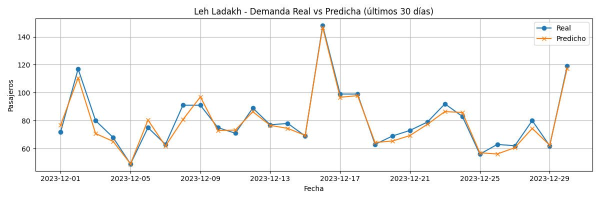
```

**Descripción:**
La **Figura 11** presenta la comparación para la ruta **Leh Ladakh**, donde la demanda es muy estacional y concentrada en pocos meses. Esto hace que el modelo tenga un desafío mayor, pero logra captar correctamente los picos durante la temporada accesible.


```{r fig12-per-route-tajmahal, out.width="70%", fig.align='center', fig.cap='Figura 12. Comparación entre la demanda real y la demanda predicha para la ruta Taj Mahal.'}
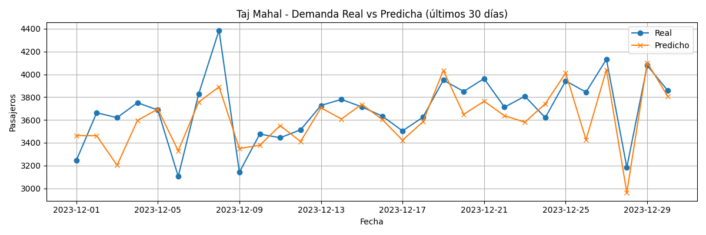
```

**Descripción:**
La **Figura 12** muestra los resultados para **Taj Mahal**, uno de los destinos con mayor volumen de pasajeros. El modelo captura con bastante precisión los comportamientos regulares, aunque presenta ligeras desviaciones en algunos períodos de alta demanda.


## 3.8 Conclusiones {#38-conclusiones}

* El modelo desarrollado, basado en una red LSTM con mecanismo de atención, logra capturar adecuadamente los patrones temporales y estacionales presentes en la demanda de transporte.

* El error absoluto medio representa aproximadamente **1% del valor medio de la demanda**, lo cual indica que el modelo tiene una excelente capacidad predictiva para un problema de esta naturaleza.

* La inclusión de variables como condiciones meteorológicas, tipo de vehículo, destino, horarios y estacionalidades contribuyó significativamente a la mejora en la precisión del modelo.

* Aunque el RMSE es más alto debido a algunos errores puntuales, en general las predicciones son bastante consistentes.

* Este modelo es adecuado para ser utilizado en la planificación operativa, como asignación de vehículos, gestión de rutas o estimación de ingresos en base a la demanda proyectada.

---


# 4 Módulo 2: Clasificación de Conducción Distractiva {#modulo2}

> Para el diseño de nuestra arquitectura base, nos inspiramos en el trabajo de Ghaffar (2023), quien desarrolla un sistema de clasificación de imágenes para conductores distraídos usando redes convolucionales. A partir de este estudio, adaptamos una arquitectura más pequeña y eficiente, ajustada a nuestro conjunto de datos de 7.267 imágenes, con el fin de mantener una buena capacidad de generalización sin sobreentrenamiento.

El modelo propuesto por Ghaffar (2023) incluía siete capas convolucionales y múltiples capas densas para una clasificación de 10 clases con más de 22.000 imágenes. En nuestro caso, adaptamos esta arquitectura reduciendo significativamente la cantidad de capas y parámetros, ajustando la red a un conjunto más pequeño (7.267 imágenes) y a un dominio específico de cinco clases, logrando así un modelo más eficiente y menos propenso al sobreajuste.

## 4.1 Descripción del Dataset {#41-descripción-del-dataset}

El conjunto de datos utilizado proviene de escenas reales captadas dentro de vehículos en movimiento en Dhaka, Bangladesh. Incluye imágenes etiquetadas manualmente con cinco categorías de comportamiento del conductor:

- `safe_driving`: conducción atenta y segura
- `turning`: movimiento de giro o cambio de dirección
- `texting_phone`: uso activo del teléfono para escribir
- `talking_phone`: uso del teléfono en llamada
- `other_activities`: cualquier otra actividad distractora, como comer, dormir o interactuar con otros pasajeros

El total de imágenes asciende a **7.267**, con una distribución de clases razonablemente balanceada. Esta distribución se visualiza en la Figura 13.

```{r fig13-distrib-clases, out.width="60%", fig.align='center', fig.cap='Figura 13. Distribución de imágenes por clase en el dataset'}
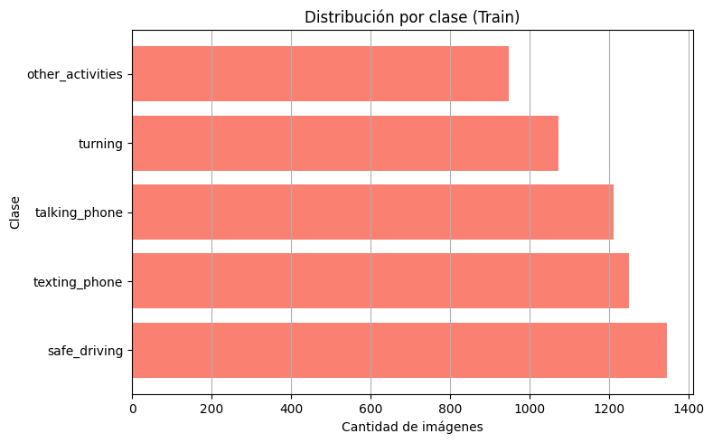
```

## 4.2 Preprocesamiento de Imágenes {#42-preprocesamiento-de-imágenes}

Las imágenes se redimensionaron a 224x224 píxeles y fueron procesadas utilizando `ImageDataGenerator`, con aumentos que incluyeron rotaciones, traslaciones, zoom, modificaciones de brillo y espejado horizontal. Esto nos permitió incrementar la diversidad del conjunto de entrenamiento y mejorar la generalización del modelo.

Adicionalmente, empleamos `class_weights` calculados con `sklearn.utils.class_weight.compute_class_weight()` para penalizar la pérdida en función de la frecuencia de cada clase.

También realizamos una exploración visual de las imágenes y ejemplos aleatorios, como se muestra en la Figura 14.

```{r fig14-ejemplos-batch, out.width="60%", fig.align='center', fig.cap='Figura 14. Ejemplos aleatorios de imágenes del dataset'}
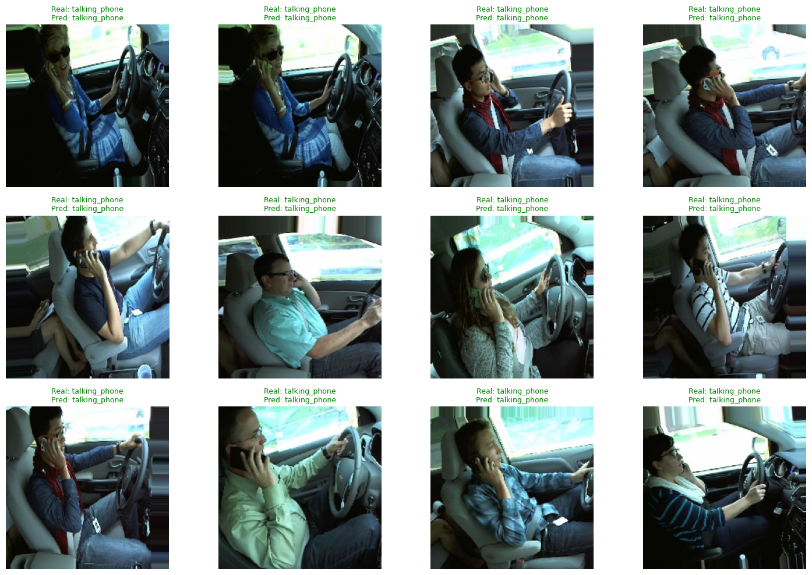
```

## 4.3 Arquitectura del Modelo {#43-arquitectura-del-modelo}

Inspirados en arquitecturas más complejas como AlexNet, diseñamos una red convolucional más ligera y eficiente con tres bloques convolucionales, regularización L2, `BatchNormalization` y `Dropout` entre capas. El modelo fue entrenado con:

- Activación final: `softmax`
- Función de pérdida: `sparse_categorical_crossentropy`
- Callbacks: `EarlyStopping` y `ModelCheckpoint`
- División: 80% entrenamiento / 20% validación

Este enfoque bottom-up nos permitió controlar el tamaño y complejidad del modelo en relación con el tamaño del dataset disponible.

## 4.4 Evaluación y Resultados {#44-evaluación-y-resultados}

La Figura 15 muestra el comportamiento del modelo durante el entrenamiento. Se observa una convergencia estable, aunque con señales de sobreajuste moderado a partir de la época 25.

```{r fig15-accuracy-loss, out.width="60%", fig.align='center', fig.cap='Figura 15. Evolución de precisión y pérdida durante el entrenamiento'}
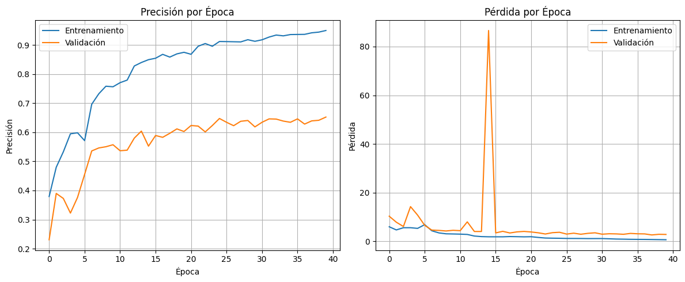
```

La matriz de confusión (Figura 16) muestra un rendimiento destacado en clases clave como `talking_phone`, `texting_phone` y `safe_driving`.

```{r fig16-conf-matrix, out.width="60%", fig.align='center', fig.cap='Figura 16. Matriz de confusión del modelo en el conjunto de validación'}
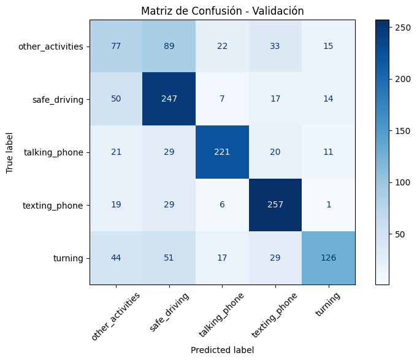
```

A continuación se resumen las métricas de evaluación por clase:

```{r tabla-metricas-cnn}
tabla_metricas <- data.frame(
  Clase = c("other_activities", "safe_driving", "talking_phone", "texting_phone", "turning"),
  Precisión = c(0.36, 0.56, 0.81, 0.72, 0.75),
  Recall = c(0.33, 0.74, 0.73, 0.82, 0.47),
  F1_Score = c(0.34, 0.63, 0.77, 0.77, 0.58)
)

knitr::kable(tabla_metricas,
  caption = "Tabla 2: Métricas por clase para el modelo de clasificación de conducción distractiva",
  format = "html"
) %>%
  kableExtra::kable_styling(
    bootstrap_options = c("striped", "hover"),
    full_width = FALSE
  ) %>%
  kableExtra::column_spec(1:4, width = "4cm") %>%
  kableExtra::row_spec(0, bold = TRUE, color = "black", background = "lightgray")
```

El modelo alcanzó un accuracy global de **64.7%**, con un F1-score macro de **0.627**. Esto refleja un rendimiento adecuado, especialmente en las clases asociadas a conductas distractoras críticas como `texting_phone` y `talking_phone`.


## 4.6 Proceso Iterativo de Optimización del Modelo {#46-proceso-optimizacion}

A lo largo del desarrollo del módulo de clasificación, realizamos múltiples pruebas con variantes del modelo para alcanzar el rendimiento observado. Este fue el resultado de un proceso iterativo extenso, basado en las siguientes estrategias:

- **Reducción progresiva de la arquitectura:** Partimos de un modelo de referencia más grande compartido en una guía técnica (Ghaffar, 2023), diseñada para más de 22.000 imágenes. Ante la diferencia en la cantidad de datos disponibles (7.267 imágenes), optamos por rediseñar la arquitectura, reduciendo su profundidad y cantidad de parámetros para evitar sobreajuste.
- **Comparación de técnicas de regularización:** Probamos diversos valores de `Dropout` (entre 0.3 y 0.5) en diferentes bloques, así como el uso de **regularización L2**, observando su efecto sobre las métricas de validación.
- **Uso de `BatchNormalization` y tuning de learning rate:** Experimentamos con y sin normalización por lotes, y modificamos la tasa de aprendizaje para evitar que el modelo convergiera demasiado rápido en mínimos locales.
- **Ajuste de resolución de imágenes:** Aunque inicialmente trabajamos con 128x128, descubrimos que el modelo ganaba capacidad discriminativa al aumentar la resolución a 224x224, especialmente en clases como `texting_phone` y `talking_phone`.
- **Estrategias de entrenamiento y callbacks:** Implementamos `EarlyStopping` para prevenir sobreentrenamiento y restaurar automáticamente los mejores pesos mediante `ModelCheckpoint`.
- **Múltiples ejecuciones con análisis de métricas:** Tras varias corridas y afinaciones, elegimos el modelo con mejor rendimiento promedio en precisión y F1-score, evaluado sobre un conjunto de validación del 20%.

Además, se implementaron y evaluaron distintas arquitecturas con el fin de ajustar la capacidad del modelo al tamaño del conjunto de datos. Inicialmente se probó una arquitectura con tres bloques convolucionales, siguiendo el diseño propuesto por Ghaffar (2023). Sin embargo, esta configuración presentaba señales de sobreajuste e inestabilidad en la validación, lo cual motivó una reducción a solo dos bloques `Conv2D` combinados con una sección densa más expresiva.

Durante las iteraciones posteriores también se evaluaron:
- La sustitución de `Flatten()` por `GlobalAveragePooling2D()` para reducir la cantidad de parámetros y estabilizar el entrenamiento.
- Diversas combinaciones de capas densas (128, 256, 64 unidades) y funciones de activación (`ReLU`, `LeakyReLU`).
- Aumentos progresivos en el nivel de `Dropout` (0.3 a 0.5).
- La regularización L2 en distintas capas del modelo.
- El impacto de ajustar `class_weight` para mejorar el rendimiento en clases minoritarias como `other_activities`.

Cabe destacar que se descartaron arquitecturas basadas en modelos preentrenados (transfer learning con ResNet50 o VGG16), así como ensambles, debido a restricciones de cómputo, y en favor de mantener un modelo entrenable desde cero con una arquitectura interpretable y ajustada a nuestras necesidades. Esta elección permite una integración directa con la herramienta web sin dependencias complejas o tiempos de carga elevados.


Este proceso iterativo nos permitió alcanzar una arquitectura final con solo dos bloques convolucionales, pero con una parte densa lo suficientemente expresiva como para lograr una precisión y F1-score superiores al 62%.


## 4.5 Análisis de Distracciones Comunes y Medidas Preventivas {#45-análisis-de-distracciones-comunes}

Las clases `talking_phone` y `texting_phone` fueron las más fácilmente detectables, lo que sugiere que el modelo logró capturar patrones visuales asociados (posición del rostro, manos, presencia del celular). En contraste, `other_activities` mostró mayor confusión, debido a su heterogeneidad.

Este análisis permite proponer medidas como:

- Instalación de sistemas de monitoreo con alertas automáticas para eventos de distracción detectados.
- Capacitación a conductores con retroalimentación basada en los comportamientos detectados.
- Revisión de políticas internas para restringir el uso de dispositivos móviles en ruta.

En conclusión, el modelo cumple con los objetivos de clasificación propuestos, ofreciendo resultados sólidos en las categorías más relevantes para la seguridad vial.


# 5. Módulo 3 - Recomendación de Destinos de Viaje {#modulo3}

## 5.1 Introducción {#51-introducción}

En este módulo desarrollamos un sistema de recomendación de destinos basado en filtrado colaborativo. El objetivo es predecir la calificación (`ExperienceRating`) que un usuario daría a un destino turístico, utilizando únicamente su historial de visitas y características embebidas.

Esta tarea se formuló como un problema de regresión, donde el modelo predice una calificación entre 1 y 5. Se utilizaron embeddings para representar tanto a usuarios como destinos y se entrenó un modelo de factorización matricial con Keras.

## 5.2 Análisis Exploratorio de Datos {#52-análisis-exploratorio-de-datos}

Antes de construir el modelo, se llevó a cabo un análisis exploratorio para entender la distribución de los datos y evaluar qué variables debían ser incluidas o descartadas.

### Distribución de Calificaciones

```{r fig17, out.width="60%", fig.align='center', fig.cap='Figura 17. Distribución de la variable ExperienceRating'}
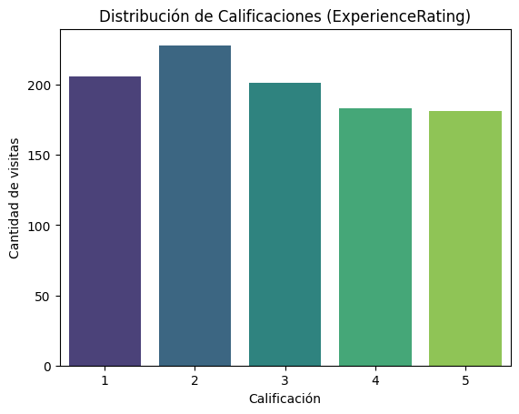
```

La variable `ExperienceRating` presenta una distribución relativamente uniforme, sin sesgo marcado hacia los extremos. Esto sugiere que el modelo no deberá compensar clases desbalanceadas.

### Destinos más populares

```{r fig18, out.width="60%", fig.align='center', fig.cap='Figura 18. Tipos de destino más comunes en el dataset'}
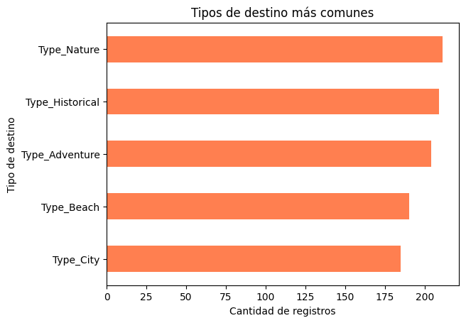
```

La frecuencia de destinos está relativamente balanceada entre las distintas categorías, destacándose ligeramente los destinos de naturaleza e historia.

### Distribución por género

```{r fig19, out.width="60%", fig.align='center', fig.cap='Figura 19. Distribución por género en los registros'}
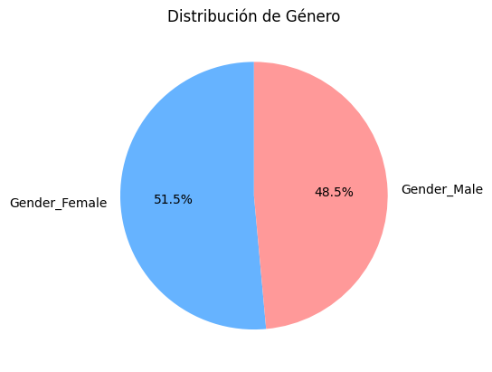
```

Se observa una distribución balanceada entre hombres y mujeres, lo cual es positivo en términos de representatividad del modelo.

### Calificación por tipo de destino

```{r fig20, out.width="60%", fig.align='center', fig.cap='Figura 20. Distribución de ratings por tipo de destino'}
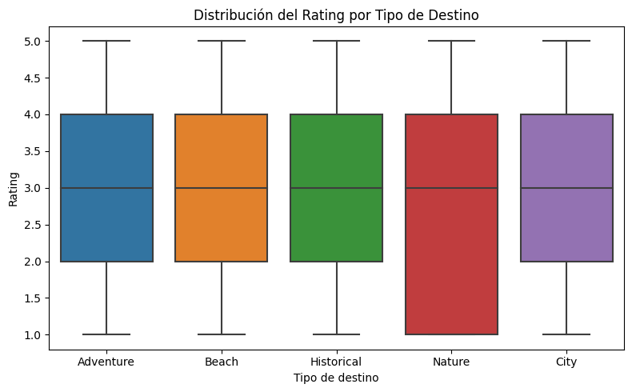
```

Las medianas de calificación son similares entre los distintos tipos de destino, sin variaciones fuertes que justifiquen un modelo específico por categoría.

### Correlaciones con `ExperienceRating`

```{r fig21, out.width="60%", fig.align='center', fig.cap='Figura 22. Correlación de variables con ExperienceRating'}
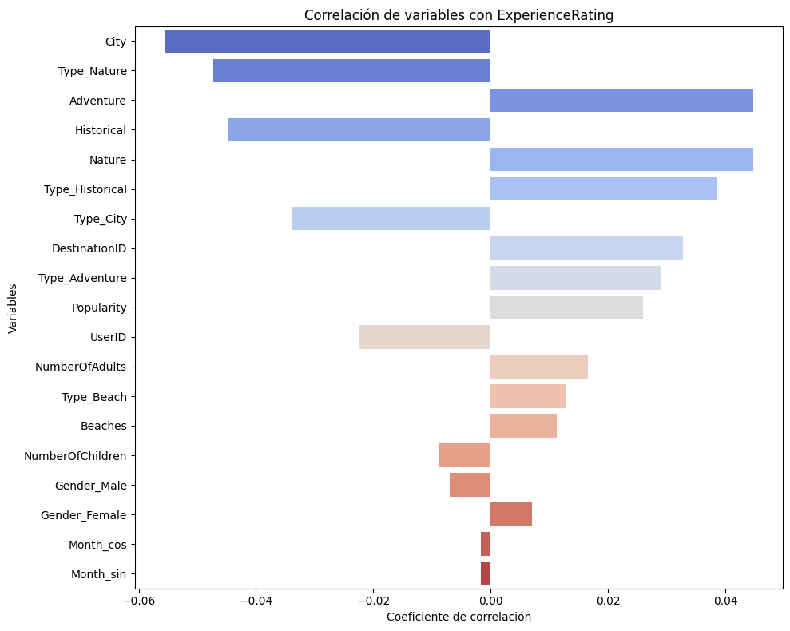
```

No se evidencian correlaciones lineales fuertes con la variable objetivo, lo que valida el uso de una red neuronal para modelar relaciones no lineales complejas.

### Preferencias más comunes

```{r fig23, out.width="60%", fig.align='center', fig.cap='Figura 24. Preferencias más comunes de los usuarios'}
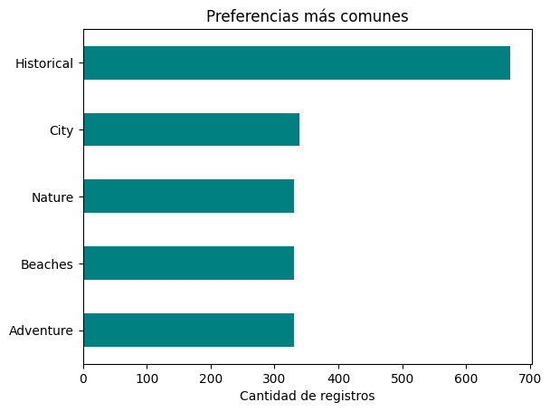
```

Las preferencias de los usuarios son consistentes con las categorías más visitadas, especialmente el interés por lo histórico y la naturaleza.

### Distribución de visitas por mes

```{r fig25, out.width="60%", fig.align='center', fig.cap='Figura 25. Cantidad de visitas registradas por mes'}
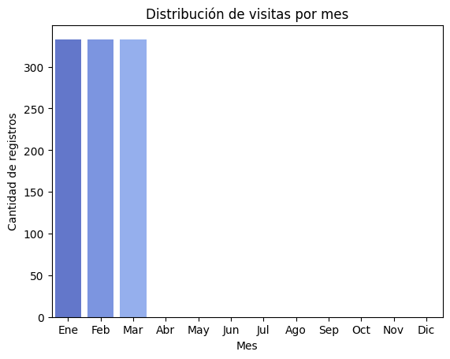
```

Los datos están concentrados en el primer trimestre del año. Esto debe tenerse en cuenta para evitar sesgos temporales en los resultados.

## 5.3 Arquitectura del Modelo {#53-arquitectura-del-modelo}

El modelo empleado es una red neuronal basada en factorización matricial simple con Keras. Esta arquitectura consiste en:

- Embedding para `UserID` y `DestinationID`
- Producto punto entre vectores de usuario y destino
- Salida única como predicción continua (regresión)

Se utilizó la función de pérdida MSE y el optimizador Adam. El modelo fue entrenado con `EarlyStopping` y `ModelCheckpoint`.

## 5.4 Evaluación y Resultados {#54-evaluación-y-resultados}

### Curva de pérdida durante el entrenamiento

```{r fig26, out.width="60%", fig.align='center', fig.cap='Figura 26. Evolución de la pérdida MSE en train y validación'}
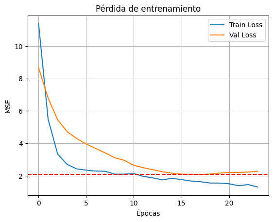
```

Se observa una clara convergencia del modelo. La validación se estabiliza alrededor de la época 15, lo cual sugiere una buena capacidad de generalización.

### Predicción vs Real

```{r fig27, out.width="60%", fig.align='center', fig.cap='Figura 27. Comparación entre rating real y predicho'}
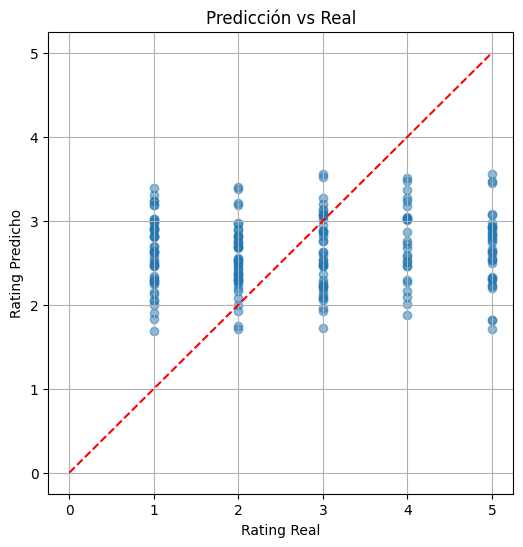
```

El modelo tiende a subestimar ligeramente los valores altos de rating, pero logra capturar la tendencia general de los datos.

### Métricas Finales

```{r tabla-metricas-recom, echo=FALSE}
knitr::kable(
  data.frame(
    Métrica = c("MAE", "RMSE", "Correlación"),
    Valor = c(1.226, 1.493, 0.083)
  ),
  caption = "Tabla 3: Métricas finales del modelo de recomendación",
  format = "html"
) %>%
  kableExtra::kable_styling(bootstrap_options = c("striped", "hover"), full_width = FALSE) %>%
  kableExtra::row_spec(0, bold = TRUE, color = "black", background = "lightgray")
```

## 5.5 Conclusiones {#55-conclusiones}

- Se logró construir un sistema de recomendación con un error promedio de 1.2 estrellas, lo cual es aceptable para fines exploratorios.
- El modelo es simple, eficiente y puede integrarse fácilmente en una plataforma de turismo inteligente.
- El filtrado colaborativo con embeddings demuestra ser efectivo incluso en conjuntos de datos con poca correlación lineal.

# 6. Herramienta Web Integrada {#herramienta-web}

Gráficas de predicción vs. demanda real para cada ruta de transporte.

Ejemplos de imágenes clasificadas correctamente y casos erróneos.

Ejemplos de recomendaciones generadas para diferentes usuarios, mostrando destinos de viaje basados en
preferencias previas.
Análisis de la efectividad de las recomendaciones (usuarios satisfechos, incremento en la demanda de
ciertas rutas, etc.).

# 7. Resultados Generales y Discusión {#resultados}

## Lecciones Aprendidas y Limitaciones del Módulo 1

El desarrollo del modelo LSTM con atención permitió capturar patrones temporales como la estacionalidad, el efecto del clima y los eventos especiales en la demanda de transporte. Incorporar estas variables fue clave para mejorar las predicciones.

Sin embargo, se presentaron desafíos en rutas con alta variabilidad o baja demanda, donde el modelo mostró mayor error. Además, al trabajar con datos sintéticos y agregados por día, el modelo puede no generalizar perfectamente a escenarios reales o predicciones en tiempo real.

A pesar de estas limitaciones, el modelo demuestra ser una base sólida para entender el comportamiento de la demanda y abre la puerta a futuras mejoras.

## Lecciones Aprendidas y Limitaciones del Módulo 2

Durante el desarrollo del modelo de clasificación de conducción distractiva, aprendimos que construir una arquitectura CNN desde cero nos permite tener un mayor control sobre la complejidad del modelo y adaptarlo eficientemente al tamaño del dataset disponible. A diferencia de las arquitecturas preentrenadas, nuestra versión manual balanceó precisión y eficiencia computacional, logrando buenos resultados en clases críticas como `texting_phone` y `talking_phone`.

También descubrimos la importancia del **aumento de datos y la regularización**, especialmente cuando se trabaja con volúmenes moderados de imágenes. Técnicas como `Dropout`, `L2`, y `class_weights` fueron claves para evitar el sobreajuste sin sacrificar rendimiento.

Sin embargo, enfrentamos limitaciones que vale la pena mencionar:

- La clase `other_activities` fue difícil de modelar debido a su heterogeneidad. Una mejor estrategia podría ser subdividirla en comportamientos más específicos.
- Aunque el modelo fue entrenado y evaluado en condiciones realistas, su despliegue en entornos reales requeriría ajustes adicionales como detección en tiempo real, control de calidad en imágenes y latencia mínima.

Estas lecciones sientan las bases para futuras mejoras del sistema y para su integración en contextos reales de monitoreo de seguridad vial.

## Lecciones Aprendidas y Limitaciones del Módulo 3

Durante el desarrollo del sistema de recomendación basado en filtrado colaborativo, comprendimos que incluso modelos simples como la factorización matricial con embeddings pueden ofrecer un rendimiento competitivo cuando se entrenan adecuadamente y se alimentan con datos bien estructurados.

Una de las principales lecciones fue el valor de **representar entidades (usuarios y destinos) mediante vectores entrenables**, lo cual permite capturar relaciones latentes sin necesidad de utilizar información explícita o textual. Esta estrategia redujo la dimensionalidad del problema y facilitó la generalización.

Asimismo, aprendimos que, a pesar de la aparente debilidad de correlaciones lineales entre variables y la calificación (`ExperienceRating`), un modelo no lineal fue capaz de extraer patrones útiles para la predicción.

Sin embargo, enfrentamos algunas limitaciones importantes:

- El modelo tiende a **subestimar calificaciones altas** y sobreestimar las bajas, probablemente debido a la regularización implícita en el aprendizaje de los embeddings.
- El sistema no incorpora aún información contextual rica (como texto libre o comportamiento reciente), lo cual limita su capacidad para personalizar recomendaciones más allá del historial básico.
- Las recomendaciones actuales se basan en **preferencias históricas globales**, sin tener en cuenta factores como la temporalidad, la disponibilidad de destinos o las restricciones del usuario.

Estas experiencias nos orientan hacia futuras mejoras como la incorporación de filtros dinámicos, variables contextuales y estrategias híbridas que combinen filtrado colaborativo con contenido explícito.

# 8. Conclusiones y Recomendaciones {#conclusiones}

Este proyecto logró desarrollar e integrar tres sistemas basados en inteligencia artificial enfocados en el ámbito del transporte y el turismo: un modelo de predicción de demanda, un modelo de clasificación de conducción distractiva y un sistema de recomendación turística.

En el módulo de predicción de demanda, el uso de redes neuronales LSTM con mecanismo de atención demostró ser efectivo para capturar patrones estacionales, horarios y contextuales. A pesar de trabajar con datos sintéticos, el modelo mostró un buen desempeño relativo, lo que valida su diseño y su potencial aplicabilidad en entornos reales.

El modelo de clasificación de conducción distractiva permitió comprender la importancia del diseño arquitectónico y de técnicas de regularización, especialmente cuando se trabaja con datos visuales y múltiples categorías de comportamiento.

Por su parte, el sistema de recomendación implementado mostró cómo el análisis de perfiles y preferencias puede ser una herramienta poderosa para mejorar la experiencia de los usuarios en el sector turístico.

Entre las principales recomendaciones se destacan:

* Para modelos de predicción de demanda, trabajar en futuros proyectos con datos reales permitirá evaluar la robustez del modelo frente a patrones más complejos, además de garantizar su escalabilidad y aplicabilidad operativa.

* Es recomendable explorar modelos más avanzados como Transformers para tareas de predicción de series temporales, dado su rendimiento superior en problemas con dependencias de largo plazo.

* En la clasificación de conducción, sería pertinente ampliar el dataset con más clases o contextos, así como considerar el uso de arquitecturas preentrenadas para mejorar la generalización.

* Para sistemas de recomendación, incorporar técnicas basadas en aprendizaje profundo o en modelos híbridos puede aumentar la personalización y la calidad de las sugerencias.

En general, este proyecto evidencia que la aplicación de modelos de inteligencia artificial en transporte y turismo no solo es viable, sino también altamente efectiva cuando se realiza un diseño cuidadoso tanto de los datos como de los modelos.

# 9. Aspectos Éticos y Creatividad {#etica}

Durante el desarrollo de este proyecto, consideramos diversos aspectos éticos asociados al uso de datos y modelos de inteligencia artificial en el sector del transporte y turismo.

En primer lugar, aunque el dataset de predicción de demanda fue generado de manera sintética, en un escenario real sería fundamental garantizar la privacidad de los datos personales de los usuarios, especialmente en los sistemas de recomendación y monitoreo de conductores. La anonimización y la protección de datos sensibles serían requisitos indispensables.

Otro aspecto crítico es el sesgo en los datos. Al trabajar con datos históricos o específicos de ciertas regiones, existe el riesgo de que los modelos reproduzcan patrones injustos o no generalicen correctamente a otros contextos. Esto se observa, por ejemplo, en rutas con baja frecuencia o en comportamientos atípicos en el módulo de clasificación de conducción.

En cuanto al módulo de recomendación, es importante garantizar la transparencia del sistema, evitando que las recomendaciones sean influenciadas únicamente por criterios comerciales y asegurando que respeten las preferencias reales de los usuarios.

Finalmente, desde la creatividad, este proyecto demuestra cómo es posible integrar tres modelos distintos (predicción, clasificación y recomendación) en un ecosistema unificado. La generación de un dataset sintético realista, el diseño manual de arquitecturas de redes neuronales, y el despliegue de una herramienta web accesible, reflejan un proceso creativo con foco tanto en la innovación técnica como en la solución de problemas prácticos.

# 10. Bibliografía {#bibliografia}


<h2>Referencias</h2>

<ul>
  <li>Xiao, X., Li, C., Wang, X., & Zeng, A. (2025). Personalized tourism recommendation model based on temporal multilayer sequential neural network. <i>Scientific Reports, 15</i>(1), 382. <a href="https://doi.org/10.1038/s41598-024-84581-z" target="_blank">https://doi.org/10.1038/s41598-024-84581-z</a></li>
  <li>Sorum, N. G., & Sorum, M. G. (2025). Modeling of injury severity of distracted driving accident using statistical and machine learning models. <i>PLoS One, 20</i>(6), e0326113. <a href="https://doi.org/10.1371/journal.pone.0326113" target="_blank">https://doi.org/10.1371/journal.pone.0326113</a></li>
  <li>Gao, K., Yang, J., Zhang, H., & Zhao, Z. (2023). Forecasting ride-hailing demand with LSTM neural networks: A case study in Shanghai. <i>Journal of Transport Geography, 109</i>, 103540. <a href="https://doi.org/10.1016/j.jtrangeo.2023.103540" target="_blank">https://doi.org/10.1016/j.jtrangeo.2023.103540</a></li>
  <li>Khan, M. A., & Auvee, R. B. Z. (2024). Comparative analysis of resource-efficient CNN architectures for brain tumor classification. <i>arXiv preprint</i> <a href="https://arxiv.org/abs/2411.15596" target="_blank">arXiv:2411.15596</a></li>
  <li>Ghaffar, S. (2023). <i>Classification of images to detect distracted drivers by using convolutional neural networks</i> (Master’s thesis, Toronto Metropolitan University). Toronto, Canada.</li>
  <li>OpenAI. (2024). <i>ChatGPT (June 2025 version)</i> [Large language model]. <a href="https://chat.openai.com/" target="_blank">https://chat.openai.com</a></li>
  <li>Anthropic. (2024). <i>Claude AI (Claude 4 Sonnet)</i> [Large language model]. <a href="https://claude.ai/" target="_blank">https://claude.ai</a></li>
</ul>

<h2 id="11-anexos">11 Anexos</h2>

<h3>Datasets</h3>
<ul>
  <li><b>Clasificación de Conducción Distractiva:</b> <a href="https://www.kaggle.com/datasets/arafatsahinafridi/multi-class-driver-behavior-image-dataset" target="_blank">Kaggle Dataset</a></li>
  <li><b>Sistema de Recomendación Turística:</b> <a href="https://www.kaggle.com/datasets/amanmehra23/travel-recommendation-dataset" target="_blank">Kaggle Dataset</a></li>
  <li><b>Predicción de Demanda (Referencia de inspiración):</b> <a href="https://www.geeksforgeeks.org/machine-learning/transport-demand-prediction-using-regression/" target="_blank">GeeksforGeeks</a></li>
</ul>

<h3>Repositorios de Código</h3>
<ul>
  <li><b>Repositorio principal:</b> <a href="https://github.com/vasquez-esteban/RNA_G4_Prediccion_Clasificacion_Recomendacion" target="_blank">GitHub - Clasificación y análisis</a></li>
  <li><b>App web:</b> <a href="https://github.com/vasquez-esteban/RNA_G4_PCR_App" target="_blank">GitHub - App Web</a></li>
</ul>

<h3>Aplicación Web Desplegada</h3>
<ul>
  <li><a href="https://huggingface.co/spaces/evasp/rna-g4-trabajo3" target="_blank">Hugging Face Space – Demo interactiva</a></li>
</ul>

<h3>Recursos Complementarios</h3>
<ul>
  <li><b>Presentación y video (por definir):</b> <a href="#" target="_blank">[Enlace pendiente]</a></li>
</ul>
